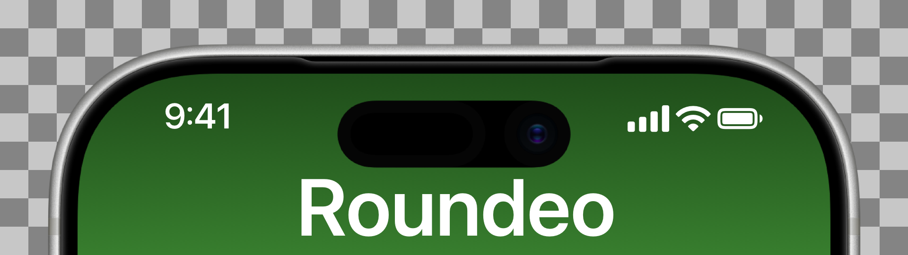
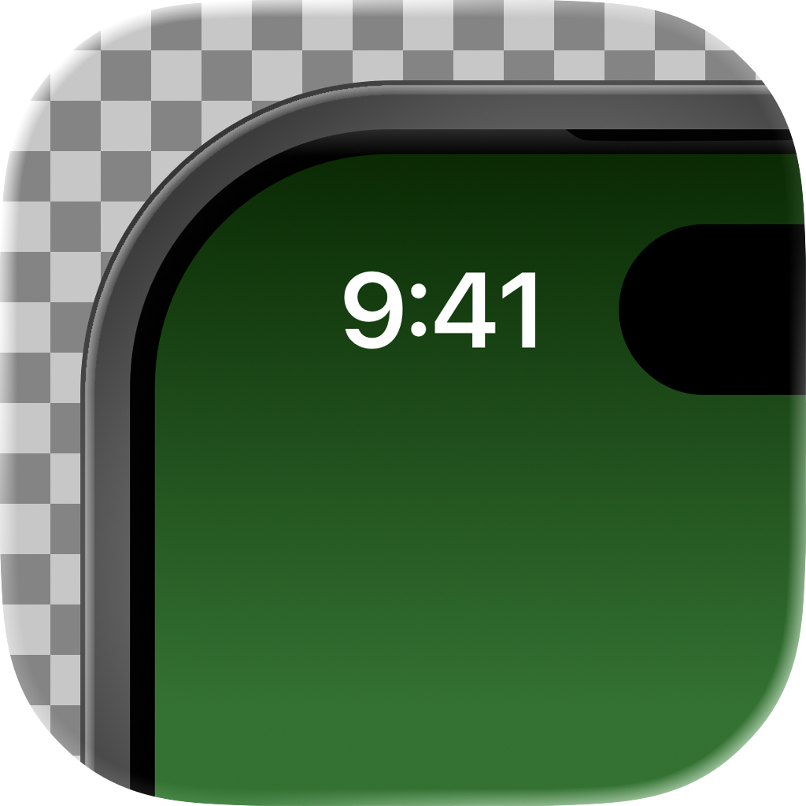

<p align="center">
  
</p>

# Roundeo

A macOS app that adds rounded corners to your videos, crops them, and exports with true transparency. Drop a video, adjust the corner radius, crop to any region, optionally overlay a device frame, and export.


## Features

- **Rounded corners with true transparency** - Exports `.mov` files with HEVC alpha so corners are genuinely transparent, not black.
- **Crop** - Interactively crop the video to any region with draggable corner handles. The preview updates live.
- **Drag and drop** - Drop a video file directly into the window to get started.
- **Live preview** - See rounded corners and crop in real time; checkerboard background shows transparent areas.
- **Corner radius control** - Fine-tune with the slider, numeric field, or drag the on-canvas green handle directly on the video.
- **PNG overlay** - Add a device frame (iPhone, iPad, Mac, etc.) as a PNG overlay. Drag to reposition with automatic center snapping and resize with corner handles. The frame stays visible while cropping.
- **Custom export size** - Set a target width and height (e.g. 1920×1080) to scale the output. Leave blank to export at the video's natural resolution.
- **Any aspect ratio** - Handles horizontal, vertical, and square videos correctly.

## Screenshots


## Usage

1. **Load a video** - Drag and drop into the window, or click **Add video** in the toolbar to browse.
2. **Crop (optional)** - Click **Crop** in the bottom bar, drag the corner handles to select a region, then click **Apply**.
3. **Set corner radius** - Use the slider, numeric field, or drag the dark green handle directly on the video.
4. **Add a frame (optional)** - Click **Add Frame** to overlay a PNG device frame. Drag to reposition (snaps to center); drag corner handles to resize.
5. **Set export size (optional)** - Enter a width and height in the **Size** fields in the bottom bar (e.g. 1920 and 1080). Leave blank to use the video's natural size.
6. **Export** - Click **Export** to save as a `.mov` file with transparent rounded corners.

## Export format

Videos are exported as `.mov` with the HEVC codec and an alpha channel. This means rounded corners and cropped edges are truly transparent — ready to use in presentations, social media, or video editing tools that support transparency.

## Requirements

- macOS 14.0+
- Xcode 15+

## Building

```bash
git clone https://github.com/your-username/Roundeo.git
```

Open `Roundeo.xcodeproj` in Xcode and run (`Cmd+R`).

## License

MIT
